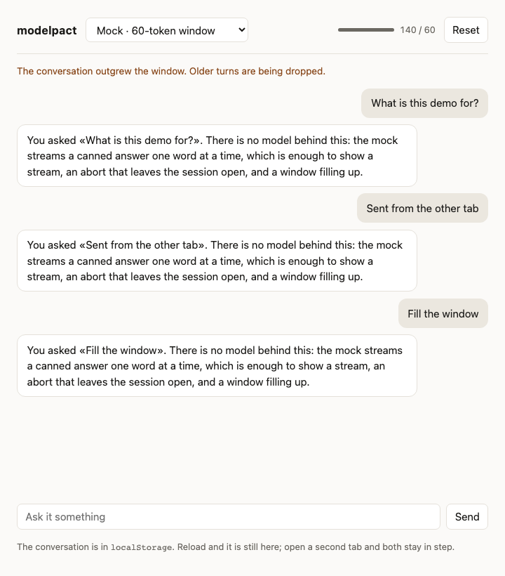
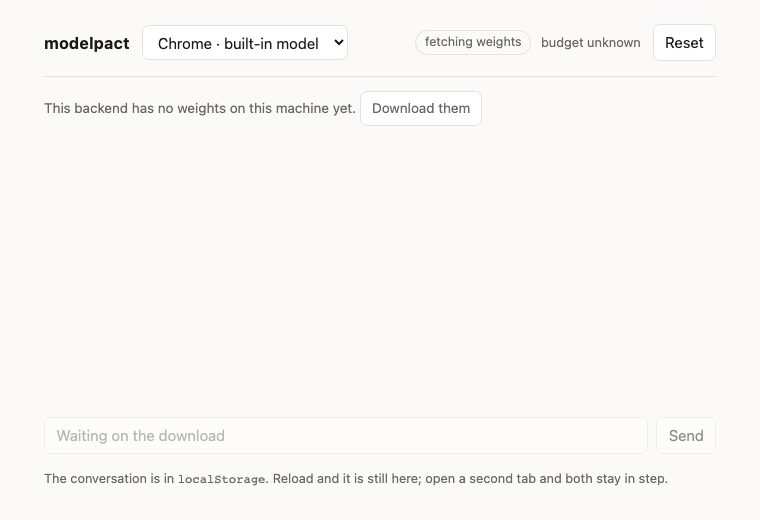

# modelpact

[](https://www.npmjs.com/package/modelpact)
[](https://github.com/AvdienkoSergey/modelpact/actions/workflows/ci.yml)


[](LICENSE)

**One way to talk to a local language model — the one built into the browser,
Ollama on your machine, or a mock in your tests. Swap the backend, keep the
code.**

## Why you'd want it

Chrome now ships a language model inside the browser. It runs on the user's
device: free, offline, private, no API key. For a web app that is the best deal
in AI — as long as your users are on Chrome.

Everyone else needs a fallback, and every fallback speaks its own dialect. A
different way to ask "are you available?", a different download story, different
errors, a different streaming format. Support two backends and you maintain two
integrations that share nothing.

modelpact is one dialect for all of them.

## What you get

**Swap backends with one line.** The provider is the only place a backend is
named. Everything after it is identical.

```ts
const provider = makePromptApiProvider(); // Chrome's built-in model
const provider = makeOllamaProvider({ model: "granite4:350m" }); // …or a daemon
const provider = makeMockProvider(); // …or nothing at all, in tests
```

**Failures that say what to do next.** No parsing exception names. Each failure
is a plain word with the data you need to act on it: `context-overflow` comes
with the usage so you can trim, `busy` tells you which call holds the session,
`unsupported-input` says what was wrong with your message.

**Bugs that don't compile.** You cannot open a session on a model that isn't
there — the method doesn't exist on that branch. You cannot read an answer
without handling the failure — the field isn't in the type. TypeScript catches
it before your users do.

**A conversation you can carry across a reload.** The session keeps the record:
what you handed it, then every completed turn. It lives in memory for one tab,
so storing it is yours — `localStorage`, IndexedDB, your server. Read it, store
it, hand it back to `open`, and the conversation continues where it was. An
aborted turn never gets in, so what you store is what the model actually saw.

**Download progress for free.** The first time a browser model is used, hundreds
of megabytes move. You get a progress event; your users get a bar instead of a
frozen page.

**Tests that need no GPU.** The mock provider is a first-class backend. Your
suite runs on any CI box.

**Bring your own backend and prove it.** Wrote an adapter for something else?
Run it through the same conformance suite the built-in providers pass. If it's
green, it behaves like the others — not "probably", provably.

## See it before you install it

[`demo/`](demo/) is one chat screen with a picker at the top. The picker holds
six backends, and each of them was one line in
[`demo/src/providers.ts`](demo/src/providers.ts) — nothing else on the screen
knows which one is answering.

```sh
cd demo && npm install && npm run dev
```

| Pick                                   | What answers                                                         |
| -------------------------------------- | -------------------------------------------------------------------- |
| `mock`, `mock-narrow`, `mock-download` | nothing: canned words, streamed one at a time, to stage every branch |
| `ollama`                               | `granite4:350m` — 708 MB on your machine, offline once it is pulled  |
| `prompt-api`                           | Chrome's built-in model, behind a consent button for its download    |
| `webgpu`                               | `SmolLM2-360M` in the tab itself, from a package outside this repo   |

<p align="center">
  
  
</p>

Everything on that screen is one of the promises above: words arriving one at a
time, a **Stop** that leaves the session open, the interrupted answer gone from
the record, a meter, a chip per `AccessKind`, an overflow warning that fires
once, a download bar that waits to be asked, and a conversation that survives a
reload and stays in step across two tabs. Ten Playwright specs — one per
promise, one per real backend in the picker, and one for a tool reading the
page — drive it in Chromium and are the repo's whole browser suite.

The last three rows are the point. A real model on a daemon, the browser's own
model, and a model on WebGPU are not three integrations here. They are three
entries in a registry, and the switch over that registry stays exhaustive — add
a seventh and the build says where a sentence is missing.

## The step, and what stands on it

Talking to a model has three storeys. A transport reaches **one model**. A
session holds **one conversation** with it and carries the guarantees — one
generation at a time, an abort that leaves the session open, an overflow that
fires once, a close that refuses everything after it. Above that, several
models, a policy, a loop over turns: orchestration.

modelpact is the middle storey, and it is deliberately only that.

| Storey        | What lives there                      | Where                                                                                |
| ------------- | ------------------------------------- | ------------------------------------------------------------------------------------ |
| transport     | one model, four answers               | `ModelBackend` — three inside the package, two written outside it                    |
| session       | one conversation, the guarantees      | **this package**, and nothing above it                                               |
| orchestration | several models, a policy, a tool loop | [`external/orchestrator`](external/orchestrator), [`external/agent`](external/agent) |

That is the direction this repo is developed in. The package does not grow up
the stairs; what grows is what stands on it, and [`external/`](external/) is
where that is tried — each package written the way a stranger would write it,
against `modelpact` at `file:../..`, through the `exports` map, with no path into
`src/`. Whatever the published API is not enough for shows up there first.

**A transport from outside.** [`external/webgpu-provider`](external/webgpu-provider)
is a model in the tab on WebGPU, through `@mlc-ai/web-llm`. It answers the same
four questions, and `describeContract` runs against it: 34 green. It also found
two real bugs — a published type that named a global consumers do not have, and a
backend that errored its own stream and landed in `unknown` instead of `aborted`.
Both fixed; both now have a guard. The demo depends on this package the way it
would on anything from npm.

**One storey up.** [`external/orchestrator`](external/orchestrator) puts Claude
from `claude -p` and a local Ollama model in one conversation, with a policy
deciding which side answers. Its first version was a `ModelBackend` composed of
two — and it passed the suite while every guarantee leaked: a meter over two
windows, an overflow that meant nothing for the other side. Rebuilt one storey
up it needed **nothing new from the package**: `open({ history })` was already
the door for handing a side the turns it missed. That is the test of whether a
storey is right.

**An agent, on the same storey.** [`external/agent`](external/agent) is a
tool-calling loop over a `Brain` — two methods, `ask` and `record` — which is an
`AiSession` or an orchestrator behind a two-line adapter. When it was written
this contract had no tool protocol, and the loop did not need one: a tool call
is a schema, honoured or refused and never ignored, and where a backend refuses
(`claude -p` does, measured) the refusal picks prose mode rather than ending
the run. A tool result goes back as the next user turn. The reference agent's
shape survived; its `bash` tool and the hundred lines of path containment it
needs did not.

**Tools, once two transports could execute them.** That loop is what showed
where a protocol was owed: Ollama returns native calls and the Prompt API spec
takes `tools` at `create`, so faking both with a schema meant two model calls
per tool and a record that called a tool result a user turn. Tools are now in
`ModelRequest` — handed over at `access`, loaded into the window at open,
executed inside the turn by the backend or the platform — and a backend with
no protocol refuses by name rather than answering as if none were asked for.
See [Tools](#tools).

Three packages, three storeys, and the thing they share is sixteen exports, a
door for transports, and a test suite. Each export is there because something outside needed it; what is
not there — storage, a router, a third role — is not missing, it lives
upstairs. The next transport is an afternoon and a green suite. The next policy
or loop is a consumer, not a feature.

## Quick start

```sh
npm install modelpact
```

```ts
import { makeMockProvider } from "modelpact";

const access = await makeMockProvider().access();
if (access.kind !== "ready") return; // unavailable, or needs a download first

const opened = await access.open({ system: "Answer in one sentence." });
if (!opened.ok) return;

const reply = await opened.value.prompt("What is this page about?");
console.log(reply.ok ? reply.value : reply.error.kind);
```

Swap `makeMockProvider` for any other provider and nothing below it changes.
That is the whole point of the line.

> **What is in.** The contract, its type-level test, the lifecycle, the
> conformance suite, tools, and three backends — the mock, Ollama, and Chrome's
> built-in model. Everything a backend needs is exported, and two more backends
> plus an orchestrator and an agent have been written outside the package on
> exactly that — see [The step, and what stands on it](#the-step-and-what-stands-on-it).

### Bring your own backend

A backend answers four questions. The lifecycle does the rest — one generation
at a time, an abort that leaves the session open, an overflow that fires once, a
close that refuses everything after it.

```ts
import { createProvider, ok, type ModelBackend } from "modelpact/backend";

const backend: ModelBackend = {
  name: "echo",
  modalities: ["text"],
  availability: () => ({ kind: "ready" }),
  connect: () => Promise.resolve(ok(model)), // your `generateStream`, `usage`, `dispose`
};

export const echo = createProvider(backend);
```

Then prove it behaves like the others:

```ts
import { describeContract } from "modelpact/testing";

describeContract("echo", () => echo);
```

`modelpact/backend` is the door for a transport author: the four answers, the
helpers that fill them — `createProvider`, `ndjsonLines`, `runTool` — and the
types they name, and nothing an app reaches for. A backend written against it
depends on that small surface rather than on the whole package; the two
outside this repo do, and their surface guards read this entry with `types`
empty. The main entry keeps re-exporting the same names until the next major.

`modelpact/testing` needs `vitest`, which is an optional peer dependency: an app
that only consumes a provider never loads it.

A backend whose transport executes tools says `tools: true`, and the suite's
tool assertions then run against it; one that does not is refused for a request
carrying tools before its `availability` is asked, and the suite checks that
refusal instead.

### Tools

A tool is a name, a description, a `JsonSchema` for its arguments and an
`execute`. It is part of the request, because it takes part in choosing the
model and is loaded into the window at open — both as the Prompt API spec has
it. The backend or the platform calls `execute` inside the turn; `prompt`
returns the final text.

```ts
const lookupColour: Tool = {
  name: "lookupColour",
  description: "Return the colour recorded for an item name.",
  inputSchema: jsonSchema({
    type: "object",
    properties: { item: { type: "string" } },
    required: ["item"],
  })!,
  execute: ({ item }, signal) => colours.get(String(item)) ?? "unknown",
};

const access = await provider.access({ tools: [lookupColour] });
```

What the session promises while a tool runs is what it promises anyway, held
for the whole turn: a second `prompt` gets `busy`; an abort reaches `execute`
through the signal it is handed, and fails the turn with `aborted`; a tool that
throws fails the turn with `failed` naming the tool, and the session stays
open. A tool that wants the model to see a problem and recover returns it as
text.

A refusal comes in two places, and a loop above has to expect both. A backend
without a protocol answers `unavailable` at `access`, with `tools: true` in the
`unsupported-config` reason. A backend with one can still fail at `open`:
Chrome 152 does — `availability()` says `available` with tools and `create()`
throws `InvalidStateError`, measured — and that lands as `invalid-state` from
`open`. Either way the move is the same: ask again without tools, and read the
call out of a schema-constrained answer, which is what
[`external/agent`](external/agent) already does.

`modelpact/tools` is a third entry, and what it holds is the fixture: a mock
tool, the counterpart of the mock provider. Words in, words out, a record of
every call, and a `reply` that can throw to stage a tool that breaks. The demo
runs its "Read the page" scene on it, and a suite that needs a call to have
happened opens a session with it. Tools that read a real page are a package
of their own, the way real transports are.

Tools cost window. Measured on Ollama across three models, one tool with a
one-sentence description and a few parameters is about 50 tokens, plus 100 to
200 for the preamble, and on Gemini Nano the window is 9 216. Eight tools are
five per cent of it; thirty-two are a fifth. Ollama resends them every turn;
the Prompt API loads them once. `OllamaConfig.maxToolRounds` bounds how many
times one turn may come back with calls before it is failed, because a small
model asked for the same listing until something stopped it.

### Several backends in one app

The list of names belongs to the app, not to this package — a backend written
elsewhere names itself. Your registry is where the set is known, so a switch over
it stays exhaustive and a string out of storage cannot pretend to be a name.

```ts
import { defineProviders, findProviderName } from "modelpact";

const PROVIDERS = defineProviders({ echo, mock: makeMockProvider() });

const name = findProviderName(
  PROVIDERS,
  localStorage.getItem("provider") ?? "",
);
const provider = name === null ? null : PROVIDERS[name];
```

## Status

**Versioned, and released by machine.** Semantic versioning from conventional
commits: [release-please](https://github.com/googleapis/release-please) opens
the release PR, [`CHANGELOG.md`](CHANGELOG.md) is written from the history, and
the tagged tree is what `npm publish` builds. A `!` in a commit is a major, and
2.0 was one — four public names changed for the better, and the changelog says
which.

**Published without a key.** npm trusts this repository and this workflow file
by name, so the release job signs in with its own OIDC identity and a
credential that lives for one publish. There is no long-lived token to leak,
and every version carries a
[provenance attestation](https://docs.npmjs.com/generating-provenance-statements)
saying which commit and which workflow built it.

**Small on purpose.** ESM only, zero runtime dependencies, and the whole entry
is 16.9 kB minified, 5.9 kB gzipped, before tree-shaking takes the providers
you do not import. `modelpact/testing` is a second entry with `vitest` as an
optional peer, so an app that only consumes a provider never loads it.

**Where it runs.** Node ≥ 22 for the Ollama backend and the suites; any current
browser for a session over `fetch`; Chrome for the built-in model. The
published declarations are checked by three outside packages with `skipLibCheck`
off and `types: []` — if a `.d.ts` ever names a global you do not have, that
build goes red before yours does.

**What a pull request has to pass.** Typecheck, lint, format, the vitest suites,
ten Playwright specs in Chromium, and the three packages under `external/` —
their own tests and their surface guards — on every change, in one run.

**Next.** An OpenAI-compatible HTTP backend: one transport for
`/v1/chat/completions`, which is the cloud APIs, vLLM, LM Studio and a
llama.cpp server at once. Same four answers, same suite, and native tool calls
the way Ollama's are handled. Then a Chrome that opens a session with tools:
when one does, what its `execute` is handed, what a rejection does and what an
abort does are three measurements the Prompt API backend is written to
survive either way.

---

## A Deep Dive for Techno-Geeks

`@types/dom-chromium-ai` follows the IDL, and the IDL is looser than
[the spec](docs/mdn/prompt_api/spec.md):
several states the algorithm rejects at runtime are writable in the types. A TS
error at the keyboard beats a `TypeError` in the browser, so
[`patches/@types+dom-chromium-ai+0.0.17.patch`](patches/@types+dom-chromium-ai+0.0.17.patch) closes the gap.

The patch is applied by `patch-package` on `prepare`, which runs for this repo
and never for anyone installing the published package. `skipLibCheck` is
deliberately **off** in `tsconfig.json`: these declarations are the only
third-party ones in the project, and type-checking them is how a patch that
stops applying cleanly gets caught.

## The contract

[`src/types`](src/types) is eight files and no runtime dependencies. Each holds one
layer, and a fact lives on the type it is about: what a field means sits on the
type rather than at every place it is read, so go-to-definition walks the
reasoning instead of finding it restated.

| File                                         | Holds                                                                             |
| -------------------------------------------- | --------------------------------------------------------------------------------- |
| [`foundations.ts`](src/types/foundations.ts) | `Result`, and the branded `Tokens`, `Fraction`, `JsonSchema`.                     |
| [`messages.ts`](src/types/messages.ts)       | `AiMessage`, `Modality`, `ModelRequest`.                                          |
| [`usage.ts`](src/types/usage.ts)             | `ContextUsage` — unknown, unbounded or bounded — and `UsageKind`.                 |
| [`failures.ts`](src/types/failures.ts)       | `AiFailure` and `FailureKind`, the mapping `failureFromError`, `AiError`.         |
| [`session.ts`](src/types/session.ts)         | `AiSession`, `ModelAccess` and `AccessKind`, `DownloadMonitor`, the option types. |
| [`provider.ts`](src/types/provider.ts)       | `ProviderName`, `AiProvider`.                                                     |
| [`backend.ts`](src/types/backend.ts)         | `ModelBackend`, `ModelConnection` — the four answers a provider supplies.         |
| [`tools.ts`](src/types/tools.ts)             | `Tool` — a name, a description, a schema and an `execute`.                        |

Four ideas carry the rest:

**Refusals are values.** `Result<T, AiFailure>` on the adapter boundary, so the
failure path is in the signature and cannot be skipped in silence. Inside a
provider's own implementation, exceptions are fine: `Result` spreads into every
signature it touches, and only the boundary is worth that cost.

**The failure vocabulary is cut by the caller's next move.** Not by exception
name. Kinds merge where the reaction would be the same and split where it
differs, even when the spec throws one exception for both — `unsupported-config`
(wrong environment) and `unsupported-input` (wrong message) are one
`NotSupportedError` upstream and two kinds here, because one is fixed by asking
for less and the other by sending something else.

**Mistakes are made unwritable, not guarded against.** `ModelAccess` carries
`open` only on the variants where opening can work, so "create a session on an
unavailable model" is not an error to check for at runtime — there is no
expression for it.

**A tag is a string, not an enum.** Every union here is discriminated by a
`kind`, and `AccessKind`, `FailureKind` and `UsageKind` name those sets for a
`Record` or a signature. They are derived aliases, so a new variant is in them
already, and they stay types: `"ready"` still passes where one is asked for, and
nothing of them reaches your bundle. An enum member would be a value, and a
nominal one — your own `"ready"` would stop being assignable to ours.

**A plain number is not a measurement.** `Tokens` and `Fraction` are separate
brands over `number`, because a ratio and a percentage (0.5 against 50) are both
numbers and swapping them is silent. A constructor that validates is the only way
in.

Four compiler flags beyond `strict` are load-bearing, `exactOptionalPropertyTypes`
most of all: without it `{ system: undefined }` passes as `SessionOptions`, and
every invariant that rests on an absent optional field falls apart.

### The types have their own test

[`src/types.test-d.ts`](src/types.test-d.ts) is compiled, never run. Every line
that must **not** compile carries a `@ts-expect-error`, and TypeScript reports
`TS2578: Unused '@ts-expect-error' directive` when the expected error fails to
appear. So the file builds exactly while each listed state stays
unrepresentable — loosen a type and the build breaks.

It covers thirteen of them:

1. A session cannot be opened on an unavailable model
2. A result cannot be used without handling the failure
3. Each failure carries only its own fields
4. An unbounded window cannot be subtracted from by accident
5. A system turn cannot be smuggled into the history
6. A schema is not just any object
7. Availability is asked for a specific request
8. The provider list is the app's, and switches over it stay exhaustive
9. The stream stays a stream
10. The monitor is the platform's, and ours passes for it
11. A kind alias names the set without closing it to literals
12. The record is a snapshot, not a handle
13. A tool is a schema and a function, not a bag of fields

It falls under the project tsconfig's `include`, so `npm run typecheck` checks
it. Vitest deliberately misses it — `include` there is `*.test.ts`.

## Contributing

A backend is the most useful thing to bring: four answers, `createProvider`,
and `describeContract` green. [`CONTRIBUTING.md`](CONTRIBUTING.md) has the
setup, every check CI runs and how to run it first, the commit convention, the
two rules the conformance suite will otherwise find for you, and where a change
belongs among the three storeys.

[`CODE_OF_CONDUCT.md`](CODE_OF_CONDUCT.md) is the short version of be decent.
[`SECURITY.md`](SECURITY.md) is how to report a vulnerability privately, and
what this package does and does not do with what a model says.

## License

[MIT](LICENSE)
